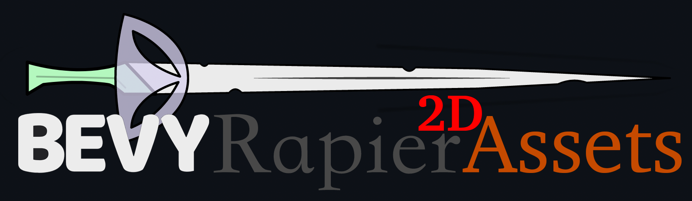

# Bevy Rapier 2D Assets Plugin

`bevy_rapier2d_assets` is a [bevy](https://github.com/bevyengine/bevy/) plugin to make it easy to load [bevy_rapier2d](https://github.com/dimforge/bevy_rapier) physics assets from disk, and a graphical editor to create said physics assets from image files.

THIS IS CURRENTLY IN A PRE-ALPHA STATE WHILE IT IS BEING CREATED. IT IS NOT YET READY TO USE! I WILL REPLACE THIS PARAGRAPH WITH A QUICK-START SECTION ONCE THIS IS READY TO BE USED.

## Huh?

I use the [rapier](https://rapier.rs/) physics engine (via the [bevy_rapier2d](https://github.com/dimforge/bevy_rapier/) plugin) for physics in my [game projects](https://www.patreon.com/nathanstocks). It is really nice once it is up and running, but there is no tooling to help set up things like colliders. You have to specify the colliders in code, using numbers you figure out yourself. That process is tedious, time consuming, and error-prone. I looked around for some tool that would help me 1) click around on my image to create a collider--a "collider editor", if you will, and 2) load that collider information from a file, so I don't have to hard-code it in my source-code.

This project is fill in that tooling gap to make it easier to create/edit colliders, save them to files, and then load the colliders from files into a game. To that end, there is a binary to run to create/edit/save physics files associated with images, and a plugin to use in your Bevy project to load said physics files.

NOTE: I'd love to _not_ maintain this as a separate plugin. If the upstream rapier and/or bevy orgs would ever like to fold this into their own solutions, I'd be happy to cede control to them. Until then, I need something that I can use. Manually determining collider coordinates isn't going to cut it for the amount of sprites I'm dealing with.

Oh, and if the mashup of logos at the top of this file bothers any of the owners of said logos, just [let me know](https://github.com/CleanCut/bevy_rapier2d_assets/issues/new) and I'll replace it with something else.

## Software License

Distributed under the terms of both the MIT license and the Apache License (Version 2.0).

See [license/APACHE](license/APACHE) and [license/MIT](license/MIT).

# 💖 Show Your Support 

If you would like to support development of this plugin, you can do so via [GitHub Sponsors] or [Patreon]

[Patreon]: https://www.patreon.com/nathanstocks
[GitHub Sponsors]: https://github.com/sponsors/CleanCut
